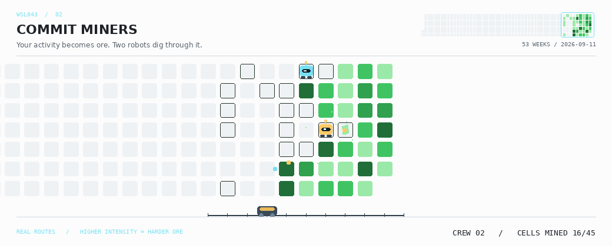
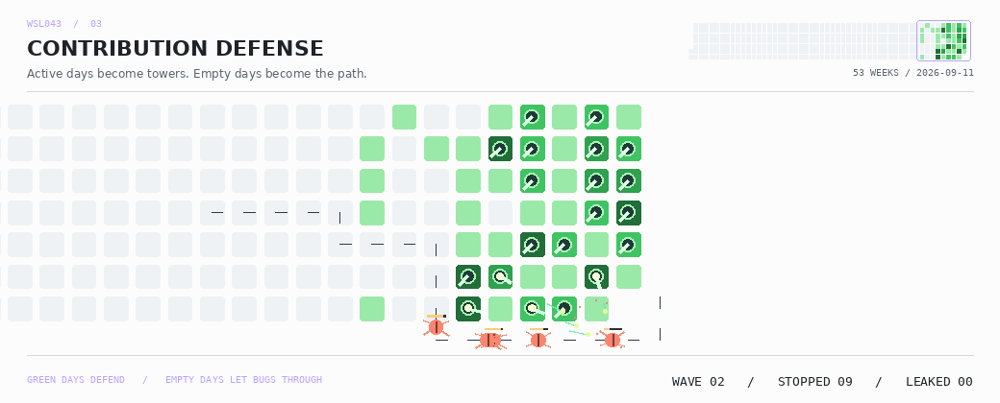
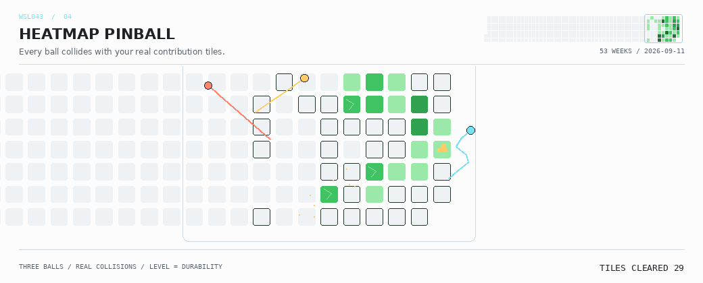
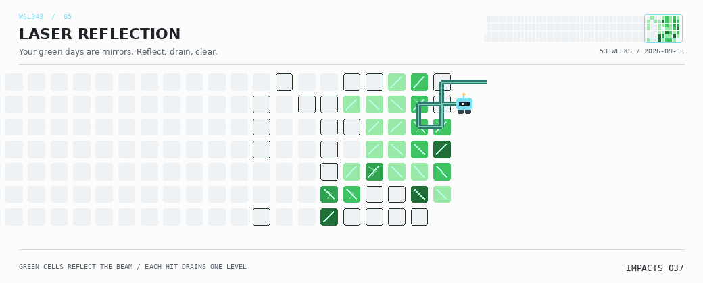
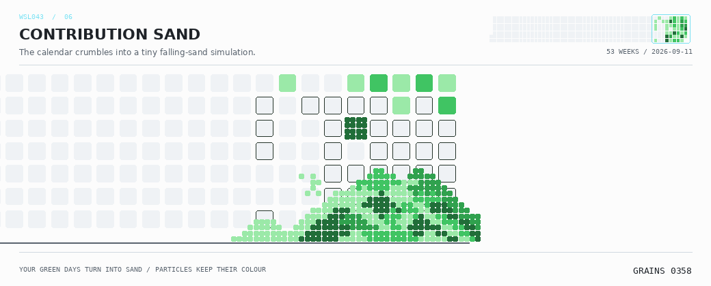

# Contribution Arcade · 热图游乐场

主页每天只展示一种；这里可以直接看六个新玩法的实际动图。图中的位置和活跃等级来自 GitHub 贡献日历，不用随机方块冒充贡献。

## 热图炸弹人 · Heatmap Bomber

绿格子是墙，等级是耐久。机器人寻路、放炸弹、撤离，十字爆炸遇墙停止，炸开的地方才能通行。

<picture>
  <source media="(prefers-color-scheme: dark)" srcset="./assets/arcade/heatmap-bomber-dark.gif">
  
</picture>

## 采矿小队 · Commit Miners

两台机器人沿空白格找矿，挖开贡献格子，把矿粒运向矿车。等级越高，开采耗时越长。

<picture>
  <source media="(prefers-color-scheme: dark)" srcset="./assets/arcade/heatmap-miners-dark.gif">
  
</picture>

## 贡献塔防 · Contribution Defense

等级 2–4 的活跃格子变成炮塔，空白格和外围通道供虫群寻路。塔的射程、射速和伤害取决于等级；消灭和漏怪来自实际模拟，不保证必胜。

<picture>
  <source media="(prefers-color-scheme: dark)" srcset="./assets/arcade/heatmap-defense-dark.gif">
  
</picture>

## 弹珠风暴 · Heatmap Pinball

三颗弹珠在活跃区域外的围框内碰撞反弹。击中一次消耗一级耐久，清除后会改变后续弹道。没有挡板，不是换皮飞船。

<picture>
  <source media="(prefers-color-scheme: dark)" srcset="./assets/arcade/heatmap-pinball-dark.gif">
  
</picture>

## 激光反射 · Laser Reflection

贡献格子变成斜面反射镜，激光遇到格子转弯并消耗一级耐久；镜子消失后，下一束激光的路径也会变。镜面方向由位置、等级与每日种子决定。

<picture>
  <source media="(prefers-color-scheme: dark)" srcset="./assets/arcade/heatmap-laser-dark.gif">
  
</picture>

## 重力落砂 · Contribution Sand

热图逐格化为保留原色的颗粒，向下掉落、绕开障碍并堆积。每个格子产生 `4 + 3 × 活跃等级` 粒砂，粒子数量守恒，不会凭空补满热图。

<picture>
  <source media="(prefers-color-scheme: dark)" srcset="./assets/arcade/heatmap-gravity-dark.gif">
  
</picture>

## 每天怎样变化

原有 Space Shooter、Breakout、Snake、Maze Chase、3D City 保留，加上新六种，共 **11 种**。用抽签袋轮换，完整新袋内每种一次，跨袋不连续重复；升级时优先展示新卡带。同日随机重跑不再次换卡，手动仍可指定。

新引擎在被选中时读取最近 365 天的 GitHub 贡献日历。日期和 0–4 活跃等级决定地图；账号、UTC 日期和玩法决定动作种子。同一天种子相同，但若贡献数据更新，场景也可能变化。生成器不写任何贡献记录，破坏的只是模拟图层。

计划沿用 **01:17 UTC（北京时间 09:17）**。GitHub 定时任务可能延迟，主页显示最后成功发布日期。六个合集动图各自保留最近一次生成结果，并非每天全部重生成。

支持深浅主题。每段循环约 18 秒；镜头会靠近活跃区域，右上保留全年缩略图。热图分散时会减少放大，避免把活跃区裁掉。外围走道、弹珠围框和落砂地板是游戏设施，不是额外的贡献日。

## 维护与手动切换

在 **Actions → Daily profile arcade → Run workflow** 选择 `experience`，保持 `generate_all=false` 即可。`refresh_native=true` 会刷新全部六个新玩法，不运行旧外部生成器；`generate_all=true` 才会重生成全部十一种。

修改引擎并推送 main 会先跑测试，再生成全部六个新玩法，首页先显示炸弹人。只有代码、依赖或 daily workflow 的改动触发这一流程；机器人提交图片不会循环触发。

选择、读取和生成作业只有只读权限；最后发布作业才有写权限。网络错误不会静默换成假数据或旧快照；缺文件、错误日期、损坏 GIF、校验和不匹配、生成期间 main 被修改，都会停止发布，保留线上版本。没有强制推送。

本地测试：

```sh
python -m pip install -r requirements-arcade.txt
python -m unittest discover -s tests -v
```

离线样片可显式给 `python -m scripts.heatmap_data` 传 `--input tests/fixtures/heatmap.json`；这个测试快照来自旧 Snake 动图，不能作为新的在线数据通过发布校验。生产环境用现有 `GITHUB_TOKEN`，无需新 PAT、密钥、服务器或 Pages。仅新增 Pillow 图像依赖，字体使用运行环境系统字体，不打包字体文件。

这些是和热图互动的**自动播放模拟**，不是键盘可操作的网页游戏。粒子数、耐久和伤害是游戏规则，不等于实际贡献次数；这里只读取可访问的贡献日历等级，不公开私有仓库内容。
