# Contribution Arcade

这里嵌入的就是主页实际使用的 **SVG 动画**，不是视频截图、HTML 演示面板，也没有把 GIF 装进 SVG。完整贡献日历始终在画面中；无局部放大、无状态面板。点击图可查看 SVG 文件。

## 我的世界风格 · Minecraft Block Miner

绿格变成草方块，像素小人挥动镐子、敲出裂纹，把每个活跃日期收进下方物品栏，再逐块还原整张日历。每日种子改变采集行序；没有凭空添加矿石。

<picture>
  <source media="(prefers-color-scheme: dark)" srcset="./assets/arcade/heatmap-minecraft-dark.svg">
  
</picture>

## LEGO 风格 · Brick Workshop

同一行、同一活跃等级的相邻日期组成 1–4 凸点积木。积木抬起、进入传送带，再由吊臂装回原来的日期，落位时轻轻弹一下。凸点和积木侧面是装饰，贡献等级和格子身份不变。

<picture>
  <source media="(prefers-color-scheme: dark)" srcset="./assets/arcade/heatmap-lego-dark.svg">
  
</picture>

## 磁力拼装 · Magnetic Assembly

真实活跃格子拆成相邻的 1–4 格小零件，旋转到下方暂存，再磁吸回每一个原来的日期。颜色和位置完全复原。分组按每日种子变化；这是磁吸拼装，不冒充带消行和重力规则的俄罗斯方块。

<picture>
  <source media="(prefers-color-scheme: dark)" srcset="./assets/arcade/heatmap-assembly-dark.svg?v=autoplay-1">
  
</picture>

## 热图连连看 · Contribution Link

相同活跃等级的两格，能通过空白格或外围走道、最多拐两次弯，就连线消除。路径真的检查障碍，不隔墙连线。配到没有合法配对即结束；奇数或被挡住的格子会留下，绝不补假贡献凑通关。停留后恢复原图，开始下一轮。

<picture>
  <source media="(prefers-color-scheme: dark)" srcset="./assets/arcade/heatmap-link-match-dark.svg?v=autoplay-1">
  
</picture>

## 传送门搬运 · Portal Courier

绿格子离开原来的日期，被橙色传送门收走，再从蓝色门逐个送回原位。搬运先后随每日种子变化，每块的原色和身份不变。两扇门是游戏设施，不是贡献日。

<picture>
  <source media="(prefers-color-scheme: dark)" srcset="./assets/arcade/heatmap-portal-dark.svg?v=autoplay-1">
  
</picture>

## 热图炸弹人 · Heatmap Bomber

空白是通路，绿格子是墙，活跃等级是耐久。机器人寻找能安全撤离的位置，放炸弹、后退，爆炸遇墙停止。一直规划到墙被清完，而不是固定演示九次爆炸。清场后贡献图逐格重建，平滑循环。

<picture>
  <source media="(prefers-color-scheme: dark)" srcset="./assets/arcade/heatmap-bomber-dark.svg?v=autoplay-1">
  
</picture>

## 采矿小队 · Commit Miners

两台矿工从上下两侧开工，沿空白格走到可开采的矿块。颜色等级越高，钻取时间越长；矿粒落向下方小车。每轮采完所有活跃格子，再恢复原图，不半途截断。

<picture>
  <source media="(prefers-color-scheme: dark)" srcset="./assets/arcade/heatmap-miners-dark.svg?v=autoplay-1">
  
</picture>

## 每天更新什么

原有的 Space Shooter、Breakout、Snake、Maze Chase 和 3D City 保留；加上这里七种，共 **12 种**。撤下上一版新增的塔防、弹珠、激光与落砂，旧 GIF 在新 SVG 验证并发布成功后移除，不影响原来的飞船 GIF。

正常每日运行会先获取最近 **365 天**的 GitHub 贡献日历，重新生成这七种 SVG 的深浅色版本；即使首页当天抽到旧玩法，这七张也更新。首页仍只展示一种，完整轮换袋每种一次、跨袋不连续重复；同日随机重跑不重复抽签。

数据决定每个格子的位置及 0–4 活跃等级；账号、UTC 日期和玩法决定动作种子。它是每日生成的快照动画，不是刷新浏览器就实时抓数据。同色等级内的贡献次数增加不一定改变地图，也不保证每次日期种子变化都肉眼明显。没有新增活跃日时不会凭空填格；没有任何活跃日时显示空日历。

计划为 **01:17 UTC（北京时间 09:17）**。GitHub 可能延迟触发；主页显示最后成功更新日期。网络失败、数据异常或生成失败，保留上一版，不用假数据冒充最新。

## 画面与边界

这些是 SVG 矢量图形 + CSS 关键帧，没有脚本、位图、外部字体、在线服务或嵌入 HTML。动画时长随地图规模变化，完成动作后收尾并恢复初始状态。本合集的七种 SVG 在屏幕上自动循环播放，不再因“减少动态效果”偏好切换成静态图；打印时显示完整的原始日历。

仍然是自动播放的热图演出，不支持按键操作。小游戏不修改真实贡献记录。墙耐久、矿粒和配对规则属于模拟规则，不是精确提交次数；仅使用可访问的日期和等级，不展示私有仓库内容。

## 维护

Actions → Daily profile arcade → Run workflow 可以指定 `experience`。默认 `refresh_native=true` 刷新七种 SVG；`generate_all=true` 才会连原来五个外部生成器一起刷新。

只有发布作业有 `contents: write`。提交前检查源日期、SHA-256、矢量元素白名单、完整日历画幅与主分支是否被更新；不强制推送。项目介绍不改。原生 SVG 引擎只用 Python 标准库；飞船等原有外部生成器保留各自依赖。

```sh
python -m unittest discover -s tests -v
python scripts/rotate_arcade.py --experience assembly --refresh-native true
# GH_TOKEN 应由 Actions 环境提供，不要写进代码或 README。
python -m scripts.heatmap_data --selection rotation-output/selection.json
```

离线预览可加 `--input tests/fixtures/heatmap.json`；会强制标记为 `offline-preview`，不能作为新的在线数据发布。浏览器内检查新 SVG 应用 `` 加载，不能仅根据独立 HTML 中能动就判定兼容。
