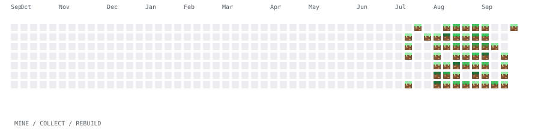

# Contribution Arcade

这里嵌入的就是主页实际使用的 **SVG 动画**，不是视频截图、HTML 演示面板，也没有把 GIF 装进 SVG。完整贡献日历始终在画面中；无局部放大、无状态面板。点击图可查看 SVG 文件。

## 我的世界风格 · Minecraft Block Miner

绿格变成草方块，像素小人挥动镐子、敲出裂纹，把每个活跃日期收进下方物品栏，再逐块还原整张日历。每日种子改变采集行序；没有凭空添加矿石。

<picture>
  <source media="(prefers-color-scheme: dark)" srcset="./assets/arcade/heatmap-minecraft-dark.svg">
  
</picture>

## 烟花秀 · Firework Show

日历先熄灯，再由五个发射台随机打出烟花，逐个点亮每一个真实的活跃日期，颜色等级不变。每日种子改变发射台与点亮顺序；没有多出任何一天。

<picture>
  <source media="(prefers-color-scheme: dark)" srcset="./assets/arcade/heatmap-fireworks-dark.svg?v=autoplay-1">
  
</picture>

## 多米诺连锁 · Domino Run

每个活跃日是一张双点多米诺骨牌，点数就是活跃等级（1–4 点）。一颗钢珠滚来撞倒第一张，整年的骨牌按列一路推倒，每张都绕底角倒下，随后倒着的骨牌快速倒放着重新立起。方向由每日种子决定，牌的位置和颜色不变。

<picture>
  <source media="(prefers-color-scheme: dark)" srcset="./assets/arcade/heatmap-domino-dark.svg?v=autoplay-1">
  
</picture>

## 像素尘埃 · Pixel Dust

从左到右，绿格子化作飘散的碎屑，再一格一格聚回原位。飘散方向和旋转由每日种子决定，聚回时颜色与位置完全复原。

<picture>
  <source media="(prefers-color-scheme: dark)" srcset="./assets/arcade/heatmap-dust-dark.svg?v=autoplay-1">
  
</picture>

## 等级分拣 · Level Sorter

每个活跃日期飞进对应等级的收纳格，底部四个格子的数量就是你真实的活跃等级分布，随后全部飞回原位。不新增日期，也不改变等级。

<picture>
  <source media="(prefers-color-scheme: dark)" srcset="./assets/arcade/heatmap-sorter-dark.svg?v=autoplay-1">
  
</picture>

## 热图合成器 · Heatmap Synth

播放头以三种速度、来回扫过整年，被扫到的绿格子脉冲发亮，下方每周一根音柱，高度等于当周真实活跃等级之和。

<picture>
  <source media="(prefers-color-scheme: dark)" srcset="./assets/arcade/heatmap-synth-dark.svg?v=autoplay-1">
  
</picture>

## 抓娃娃机 · Claw Machine

天车爪沿轨道移动，只抓每列最上面的格子，避免穿过其他格子；抓起后运到右下奖品箱，全部抓完再逐格放回原位。

<picture>
  <source media="(prefers-color-scheme: dark)" srcset="./assets/arcade/heatmap-claw-dark.svg?v=autoplay-1">
  
</picture>

## 外部生成器与致谢

除了原生 SVG 引擎，抽卡池里还有 11 个来自开源生成器的玩法。它们都用固定提交号引用，作业只有只读权限，输出文件先落到临时目录，通过校验后才提交。

| 生成器 | 许可 | 用到的玩法 |
| --- | --- | --- |
| [yoshi389111/github-profile-3d-contrib](https://github.com/yoshi389111/github-profile-3d-contrib) | MIT | 3D 贡献日历的 6 种主题：乐高方块、绿色生长、四季、夜景、夜景绿色、夜景彩虹。生成器会在旁边附带雷达图、语言环形图和统计文字，`scripts/trim_3d.py` 把它们去掉，只保留 3D 日历。 |
| [abozanona/pacman-contribution-graph](https://github.com/abozanona/pacman-contribution-graph) | 见上游仓库 | Pac-Man（迷宫追逐）、Galaga、泡泡龙、炸弹人、扫雷。 |
| [Emanuel0428/contrib-arcade](https://github.com/Emanuel0428/contrib-arcade) | MIT | 平台跳跃、数字雨。 |

原有的 Space Shooter、Breakout、Snake 仍来自各自的上游项目。

## 每天更新什么

原有的 Space Shooter、Breakout、Snake、Maze Chase 和 3D City 保留；加上上面 11 个外部玩法和这里七种原生 SVG，共 **23 种**。撤下上一版新增的塔防、弹珠、激光与落砂，旧 GIF 在新 SVG 验证并发布成功后移除，不影响原来的飞船 GIF。

正常每日运行会先获取最近 **365 天**的 GitHub 贡献日历，重新生成这七种 SVG 的深浅色版本；即使首页当天抽到旧玩法，这七张也更新。首页仍只展示一种，完整轮换袋每种一次、跨袋不连续重复；同日随机重跑不重复抽签。

数据决定每个格子的位置及 0–4 活跃等级；账号、UTC 日期和玩法决定动作种子。它是每日生成的快照动画，不是刷新浏览器就实时抓数据。同色等级内的贡献次数增加不一定改变地图，也不保证每次日期种子变化都肉眼明显。没有新增活跃日时不会凭空填格；没有任何活跃日时显示空日历。

计划为 **01:17 UTC（北京时间 09:17）**。GitHub 可能延迟触发；主页显示最后成功更新日期。网络失败、数据异常或生成失败，保留上一版，不用假数据冒充最新。

## 画面与边界

这些是 SVG 矢量图形 + CSS 关键帧，没有脚本、位图、外部字体、在线服务或嵌入 HTML。动画时长随地图规模变化，完成动作后收尾并恢复初始状态。本合集的七种 SVG 在屏幕上自动循环播放，不再因“减少动态效果”偏好切换成静态图；打印时显示完整的原始日历。

仍然是自动播放的热图演出，不支持按键操作。小游戏不修改真实贡献记录。墙耐久、矿粒和配对规则属于模拟规则，不是精确提交次数；仅使用可访问的日期和等级，不展示私有仓库内容。

## 维护

Actions → Daily profile arcade → Run workflow 可以指定 `experience`。默认 `refresh_native=true` 刷新七种 SVG；`generate_all=true` 才会连原来五个外部生成器一起刷新。

只有发布作业有 `contents: write`。提交前检查源日期、SHA-256、矢量元素白名单、完整日历画幅与主分支是否被更新；不强制推送。项目介绍不改。原生 SVG 引擎只用 Python 标准库；飞船等原有外部生成器保留各自依赖。

```sh
python -m unittest discover -s tests -v
python scripts/rotate_arcade.py --experience assembly --refresh-native true
# GH_TOKEN 应由 Actions 环境提供，不要写进代码或 README。
python -m scripts.heatmap_data --selection rotation-output/selection.json
```

离线预览可加 `--input tests/fixtures/heatmap.json`；会强制标记为 `offline-preview`，不能作为新的在线数据发布。浏览器内检查新 SVG 应用 `` 加载，不能仅根据独立 HTML 中能动就判定兼容。
