<h1 align="center">👾 WSL043</h1>

<strong>Local-first tools, desktop experiments, and useful little machines.</strong>

  <a href="https://github.com/WSL043?tab=repositories">Explore the workshop</a>
  ·
  <a href="./ENGINEERING.md">Under the hood</a>
  ·
  <a href="mailto:wangsr043@gmail.com">Say hello</a>

<!-- ARCADE:START -->
## Today's Arcade: Commit Miners

Two miners work through the whole calendar. Every ore tile is a real active day.

  <picture>
    <source media="(prefers-color-scheme: dark)"
            srcset="./assets/arcade/heatmap-miners-dark.svg">
    
  </picture>

12 cartridges · a fresh daily draw · no back-to-back repeats · Updated 2026-09-19 UTC

[Explore the SVG arcade](./ARCADE.md)
<!-- ARCADE:END -->

## Selected projects

The products and systems I keep building, testing, and refining.

| Project | What I work on |
| --- | --- |
| [**DSH Portable**](https://github.com/WSL043/DSH-Portable) | A portable desktop distribution for Windows, macOS, and Linux. Runtime packaging, independent app / kernel updates, plugin integration, and preserving user data through upgrades. |
| [**Codex Subscription for DSH**](https://github.com/WSL043/dsh-codex-subscription) | Subscription integration covering authentication, models, usage, search, and images. Account-state reconciliation, stale-response isolation, and diagnosable failure handling. |
| [**LoudEase**](https://github.com/WSL043/loudease) | Local audio normalization for Chrome. An AudioWorklet DSP pipeline with gated loudness measurement, bounded quiet-detail lift, and look-ahead limiting. [Chrome Web Store](https://chromewebstore.google.com/detail/gdkaclfjhmenjhoemdkjlpafdhengjog) · Public beta. |
| [**Updated Again**](https://github.com/WSL043/updated-again) | A self-updating software toy with signed daily capsules, a shared Web / PWA / Tauri update protocol, local rollback, and automated release recovery. [Try it](https://wsl043.github.io/updated-again/) · Developer preview. |
| [**Agent Skills Neutral**](https://github.com/WSL043/agent-skills-neutral) | A vendor-neutral reasoning and workflow library. Compact runtime bundles, source provenance, held-out evaluation, and evidence-gated workflow evolution. |

[Design decisions and implementation notes →](./ENGINEERING.md)

## Workshop rules

`local-first` · `reversible by default` · `clear over clever` · `small tools with sharp edges sanded down`

<em>Still curious. Still shipping.</em>

