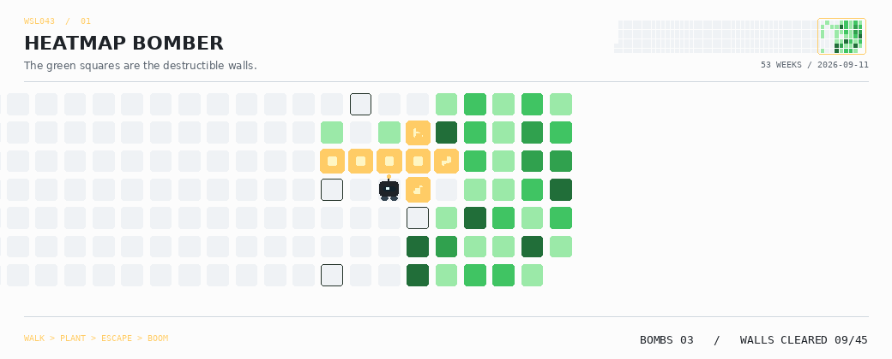

<h1 align="center">👾 WSL043</h1>

<strong>Local-first tools, desktop experiments, and useful little machines.</strong>

  <a href="https://github.com/WSL043?tab=repositories">Explore the workshop</a>
  ·
  <a href="mailto:wangsr043@gmail.com">Say hello</a>

<!-- ARCADE:START -->
## Today's Arcade: Heatmap Bomber

Find a route, plant a bomb, escape. Your green days are the walls.

  <picture>
    <source media="(prefers-color-scheme: dark)"
            srcset="./assets/arcade/heatmap-bomber-dark.gif">
    
  </picture>

11 cartridges · one daily draw · no back-to-back repeats · Published 2026-09-11 UTC

[Watch all six heatmap demos](./ARCADE.md) · Auto-play simulations, driven by contribution tiles.
<!-- ARCADE:END -->

## Pick a cartridge

| Project | What it unlocks |
| --- | --- |
| [**Codex Subscription for DSH**](https://github.com/WSL043/dsh-codex-subscription) | Bring ChatGPT and Codex subscriptions into DeepSeek Harness: models, usage, search, and image generation. |
| [**DSH Portable**](https://github.com/WSL043/DSH-Portable) | Carry the desktop app, conversations, settings, plugins, and workspace together. |
| [**DSH Chat Manager**](https://github.com/WSL043/dsh-chat-manager) | Search, archive, restore, and safely delete DeepSeek Harness conversations. |
| [**Local Dictation**](https://github.com/WSL043/dsh-dictation) | Multilingual, local speech recognition that leaves the result as an editable draft. |

## Side quests

- 🔊 [LoudEase](https://github.com/WSL043/loudease) — comfortable, consistent web audio with local processing.
- 📌 [QuotaPin for Codex](https://github.com/WSL043/QuotaPin-for-Codex) — a glanceable usage indicator in the account row.
- 🌊 [Wave Optical Transfer](https://github.com/WSL043/wave-optical-transfer) — a browser-only screen-to-camera file-transfer experiment.
- 🎮 [MG Hachimi](https://github.com/WSL043/mg_hachimi) — a reversible CS2 compatibility utility.

## Workshop rules

`local-first` · `reversible by default` · `clear over clever` · `small tools with sharp edges sanded down`

<em>Still curious. Still shipping.</em>

