<h1 align="center">👾 WSL043</h1>

<strong>Local-first tools. Playful experiments. Engineering you can inspect.</strong>

  <a href="https://github.com/WSL043?tab=repositories">Explore the workshop</a>
  ·
  <a href="./ENGINEERING.md">Under the hood</a>
  ·
  <a href="mailto:wangsr043@gmail.com">Say hello</a>

<!-- ARCADE:START -->
## Today's Arcade: Magnetic Assembly

Your calendar breaks into connected pieces, then clicks back into its exact original shape.

  <picture>
    <source media="(prefers-color-scheme: dark)"
            srcset="./assets/arcade/heatmap-assembly-dark.svg">
    
  </picture>

10 cartridges · a fresh daily draw · no back-to-back repeats · Updated 2026-09-12 UTC

[Explore the SVG arcade](./ARCADE.md)
<!-- ARCADE:END -->

## Same map. Different decisions.

<picture>
  <source media="(prefers-color-scheme: dark)" srcset="./assets/arcade/search-comparison-dark.svg">
  
</picture>

**BFS minimizes steps. Dijkstra and A\* minimize cost.** The waves and couriers above replay actual searches on the same contribution snapshot. Entry cost is `1 + contribution level`; animation speed is illustrative.

[Algorithm source](./scripts/search_race.py) · [Reproducible search traces](./assets/arcade/search-comparison.json) · [Engineering notes](./ENGINEERING.md)

<strong>What makes the arcade more than an animation?</strong>

- **Legal moves:** the bomber plans an escape outside the blast; matching tiles require an unobstructed route with at most two turns.
- **Deterministic models:** the same snapshot and seed produce the same actions; tile identity and contribution levels are preserved.
- **Checked publication:** source and file hashes are verified before publishing; a stale job cannot overwrite a newer profile.
- **Inspectable algorithms:** a separate search comparison exposes the actual paths, costs and expanded nodes. Its statistics are recomputed before publication.

[Read the models](./scripts/svg_models.py) · [Inspect the tests](./tests/test_heatmap_models.py) · [Browse all ten cartridges](./ARCADE.md)

## Things I build

| Project | Engineering focus |
| --- | --- |
| [**Codex Subscription for DSH**](https://github.com/WSL043/dsh-codex-subscription) | Local subscription integration with account-state reconciliation, stale-response isolation, and credential-free diagnostics. |
| [**DSH Portable**](https://github.com/WSL043/DSH-Portable) | A portable desktop runtime with independent app / kernel updates and explicit boundaries between program components and user data. |
| [**DSH Chat Manager**](https://github.com/WSL043/dsh-chat-manager) | Conversation search and recovery, with a stop-and-settle lifecycle and scoped directory validation before deletion. |
| [**Wave Optical Transfer**](https://github.com/WSL043/wave-optical-transfer) | Browser-based optical lanes, error correction, and verified reconstruction. **Research prototype; physical goodput unbenchmarked.** |

[Design decisions, implementation links, and verification boundaries →](./ENGINEERING.md)

## Side quests

- 🔊 [LoudEase](https://github.com/WSL043/loudease) — comfortable, consistent web audio with local processing.
- 📌 [QuotaPin for Codex](https://github.com/WSL043/QuotaPin-for-Codex) — a glanceable usage indicator in the account row.
- 🎙️ [Local Dictation](https://github.com/WSL043/dsh-dictation) — multilingual speech recognition, processed locally and returned as an editable draft.
- 🎮 [MG Hachimi](https://github.com/WSL043/mg_hachimi) — a reversible CS2 compatibility utility.

## Workshop rules

`local-first` · `reversible by default` · `clear over clever` · `small tools with sharp edges sanded down`

<em>Still curious. Still shipping.</em>

