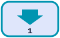
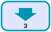
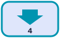
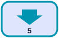
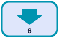
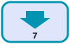
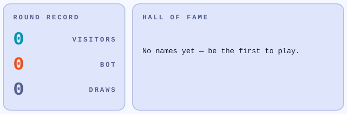
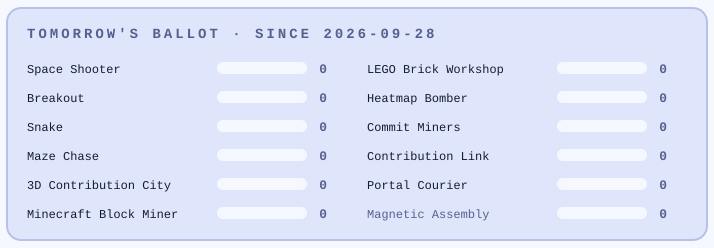

<h1 align="center">👾 WSL043</h1>

<strong>Local-first tools, desktop experiments, and useful little machines.</strong>

  <a href="https://github.com/WSL043?tab=repositories">Explore the workshop</a>
  ·
  <a href="./ENGINEERING.md">Under the hood</a>
  ·
  <a href="mailto:wangsr043@gmail.com">Say hello</a>

<!-- ARCADE:START -->
## Today's Arcade: Magnetic Assembly

Your calendar breaks into connected pieces, then clicks back into its exact original shape.

  <picture>
    <source media="(prefers-color-scheme: dark)"
            srcset="./assets/arcade/heatmap-assembly-dark.svg">
    
  </picture>

12 cartridges · a fresh daily draw · no back-to-back repeats · Updated 2026-09-28 UTC

[Explore the SVG arcade](./ARCADE.md)
<!-- ARCADE:END -->

## Player 2 wanted 🕹️

Connect Four against the workshop bot, and **everyone who visits plays the same board**. Press a column: GitHub opens a pre-filled issue, press *Submit new issue*, and a bot drops your disc, answers back, and redraws this page. Cyan is the visitors, orange is the bot.

<picture><source media="(prefers-color-scheme: dark)" srcset="./assets/play/connect4-dark.svg"></picture>

<a href="https://github.com/WSL043/WSL043/issues/new?title=arcade%3A+drop+1&body=Just+press+%22Submit+new+issue%22.+A+bot+reads+the+title%2C+plays+it%2C+and+closes+this+issue."><picture><source media="(prefers-color-scheme: dark)" srcset="./assets/play/drop-1-dark.svg"></picture></a><a href="https://github.com/WSL043/WSL043/issues/new?title=arcade%3A+drop+2&body=Just+press+%22Submit+new+issue%22.+A+bot+reads+the+title%2C+plays+it%2C+and+closes+this+issue."><picture><source media="(prefers-color-scheme: dark)" srcset="./assets/play/drop-2-dark.svg"></picture></a><a href="https://github.com/WSL043/WSL043/issues/new?title=arcade%3A+drop+3&body=Just+press+%22Submit+new+issue%22.+A+bot+reads+the+title%2C+plays+it%2C+and+closes+this+issue."><picture><source media="(prefers-color-scheme: dark)" srcset="./assets/play/drop-3-dark.svg"></picture></a><a href="https://github.com/WSL043/WSL043/issues/new?title=arcade%3A+drop+4&body=Just+press+%22Submit+new+issue%22.+A+bot+reads+the+title%2C+plays+it%2C+and+closes+this+issue."><picture><source media="(prefers-color-scheme: dark)" srcset="./assets/play/drop-4-dark.svg"></picture></a><a href="https://github.com/WSL043/WSL043/issues/new?title=arcade%3A+drop+5&body=Just+press+%22Submit+new+issue%22.+A+bot+reads+the+title%2C+plays+it%2C+and+closes+this+issue."><picture><source media="(prefers-color-scheme: dark)" srcset="./assets/play/drop-5-dark.svg"></picture></a><a href="https://github.com/WSL043/WSL043/issues/new?title=arcade%3A+drop+6&body=Just+press+%22Submit+new+issue%22.+A+bot+reads+the+title%2C+plays+it%2C+and+closes+this+issue."><picture><source media="(prefers-color-scheme: dark)" srcset="./assets/play/drop-6-dark.svg"></picture></a><a href="https://github.com/WSL043/WSL043/issues/new?title=arcade%3A+drop+7&body=Just+press+%22Submit+new+issue%22.+A+bot+reads+the+title%2C+plays+it%2C+and+closes+this+issue."><picture><source media="(prefers-color-scheme: dark)" srcset="./assets/play/drop-7-dark.svg"></picture></a>

<picture><source media="(prefers-color-scheme: dark)" srcset="./assets/play/scoreboard-dark.svg"></picture>

Needs a GitHub account · usually updates within a minute · boards refresh once GitHub's image cache lets go

### Tomorrow's cartridge is your call

Vote for what headlines the arcade at the next daily draw. One vote each, change it any time, and the most-voted cartridge wins.

<picture><source media="(prefers-color-scheme: dark)" srcset="./assets/play/ballot-dark.svg"></picture>

<a href="https://github.com/WSL043/WSL043/issues/new?title=arcade%3A+vote+space-shooter&body=Just+press+%22Submit+new+issue%22.+A+bot+reads+the+title%2C+plays+it%2C+and+closes+this+issue.">Space Shooter</a> · <a href="https://github.com/WSL043/WSL043/issues/new?title=arcade%3A+vote+breakout&body=Just+press+%22Submit+new+issue%22.+A+bot+reads+the+title%2C+plays+it%2C+and+closes+this+issue.">Breakout</a> · <a href="https://github.com/WSL043/WSL043/issues/new?title=arcade%3A+vote+snake&body=Just+press+%22Submit+new+issue%22.+A+bot+reads+the+title%2C+plays+it%2C+and+closes+this+issue.">Snake</a> · <a href="https://github.com/WSL043/WSL043/issues/new?title=arcade%3A+vote+maze-chase&body=Just+press+%22Submit+new+issue%22.+A+bot+reads+the+title%2C+plays+it%2C+and+closes+this+issue.">Maze Chase</a> · <a href="https://github.com/WSL043/WSL043/issues/new?title=arcade%3A+vote+3d-city&body=Just+press+%22Submit+new+issue%22.+A+bot+reads+the+title%2C+plays+it%2C+and+closes+this+issue.">3D Contribution City</a> · <a href="https://github.com/WSL043/WSL043/issues/new?title=arcade%3A+vote+minecraft&body=Just+press+%22Submit+new+issue%22.+A+bot+reads+the+title%2C+plays+it%2C+and+closes+this+issue.">Minecraft Block Miner</a> · <a href="https://github.com/WSL043/WSL043/issues/new?title=arcade%3A+vote+lego&body=Just+press+%22Submit+new+issue%22.+A+bot+reads+the+title%2C+plays+it%2C+and+closes+this+issue.">LEGO Brick Workshop</a> · <a href="https://github.com/WSL043/WSL043/issues/new?title=arcade%3A+vote+bomber&body=Just+press+%22Submit+new+issue%22.+A+bot+reads+the+title%2C+plays+it%2C+and+closes+this+issue.">Heatmap Bomber</a> · <a href="https://github.com/WSL043/WSL043/issues/new?title=arcade%3A+vote+miners&body=Just+press+%22Submit+new+issue%22.+A+bot+reads+the+title%2C+plays+it%2C+and+closes+this+issue.">Commit Miners</a> · <a href="https://github.com/WSL043/WSL043/issues/new?title=arcade%3A+vote+link-match&body=Just+press+%22Submit+new+issue%22.+A+bot+reads+the+title%2C+plays+it%2C+and+closes+this+issue.">Contribution Link</a> · <a href="https://github.com/WSL043/WSL043/issues/new?title=arcade%3A+vote+portal&body=Just+press+%22Submit+new+issue%22.+A+bot+reads+the+title%2C+plays+it%2C+and+closes+this+issue.">Portal Courier</a> · <a href="https://github.com/WSL043/WSL043/issues/new?title=arcade%3A+vote+assembly&body=Just+press+%22Submit+new+issue%22.+A+bot+reads+the+title%2C+plays+it%2C+and+closes+this+issue.">Magnetic Assembly</a>

## Selected projects

The products and systems I keep building, testing, and refining.

| Project | What I work on |
| --- | --- |
| [**DSH Portable**](https://github.com/WSL043/DSH-Portable) | A portable desktop distribution for Windows, macOS, and Linux. Runtime packaging, independent app / kernel updates, plugin integration, and preserving user data through upgrades. |
| [**Codex Subscription for DSH**](https://github.com/WSL043/dsh-codex-subscription) | Subscription integration covering authentication, models, usage, search, and images. Account-state reconciliation, stale-response isolation, and diagnosable failure handling. |
| [**LoudEase**](https://github.com/WSL043/loudease) | Local audio normalization for Chrome. An AudioWorklet DSP pipeline with gated loudness measurement, bounded quiet-detail lift, and look-ahead limiting. [Chrome Web Store](https://chromewebstore.google.com/detail/gdkaclfjhmenjhoemdkjlpafdhengjog) · Public beta. |
| [**Updated Again**](https://github.com/WSL043/updated-again) | A self-updating software toy with signed daily capsules, a shared Web / PWA / Tauri update protocol, local rollback, and automated release recovery. [Try it](https://wsl043.github.io/updated-again/) · Developer preview. |
| [**Agent Skills Neutral**](https://github.com/WSL043/agent-skills-neutral) | A vendor-neutral reasoning and workflow library. Compact runtime bundles, source provenance, held-out evaluation, and evidence-gated workflow evolution. |

[Design decisions and implementation notes →](./ENGINEERING.md)

## Workshop rules

`local-first` · `reversible by default` · `clear over clever` · `small tools with sharp edges sanded down`

<em>Still curious. Still shipping.</em>

