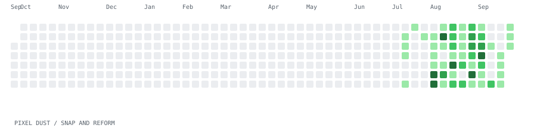

<h1 align="center">👾 WSL043</h1>

<strong>Local-first tools, desktop experiments, and useful little machines.</strong>

  <a href="https://github.com/WSL043?tab=repositories">Explore the workshop</a>
  ·
  <a href="./ENGINEERING.md">Under the hood</a>
  ·
  <a href="mailto:wangsr043@gmail.com">Say hello</a>

<!-- ARCADE:START -->
## Today's Arcade: Pixel Dust

Your green days crumble into drifting dust, then pull themselves back together.

  <picture>
    <source media="(prefers-color-scheme: dark)"
            srcset="./assets/arcade/heatmap-dust-dark.svg">
    
  </picture>

23 cartridges · a fresh daily draw · no back-to-back repeats · Updated 2026-10-01 UTC

[Explore the SVG arcade](./ARCADE.md)
<!-- ARCADE:END -->

## Workshop rules

`local-first` · `reversible by default` · `clear over clever` · `small tools with sharp edges sanded down`

<em>Still curious. Still shipping.</em>

