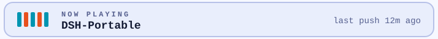
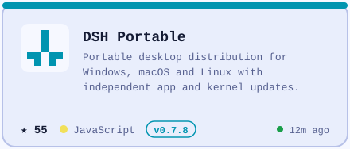
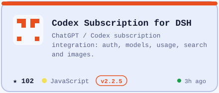
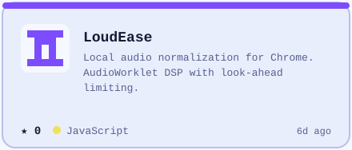
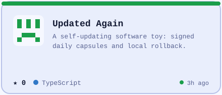
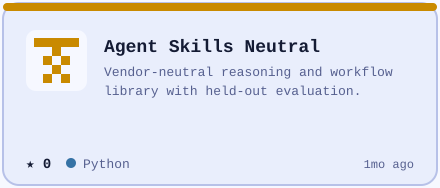
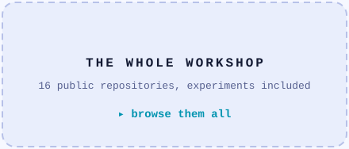

<h1 align="center">👾 WSL043</h1>

<strong>Local-first tools, desktop experiments, and useful little machines.</strong>

  <a href="https://github.com/WSL043?tab=repositories">Explore the workshop</a>
  ·
  <a href="./ENGINEERING.md">Under the hood</a>
  ·
  <a href="mailto:wangsr043@gmail.com">Say hello</a>

<a href="https://github.com/WSL043?tab=repositories"><picture><source media="(prefers-color-scheme: dark)" srcset="./assets/showcase/now-playing-dark.svg"></picture></a>

<!-- ARCADE:START -->
## Today's Arcade: Portal Courier

Your contribution tiles take the long way home, through a pair of portals.

  <picture>
    <source media="(prefers-color-scheme: dark)"
            srcset="./assets/arcade/heatmap-portal-dark.svg">
    
  </picture>

12 cartridges · a fresh daily draw · no back-to-back repeats · Updated 2026-09-29 UTC

[Explore the SVG arcade](./ARCADE.md)
<!-- ARCADE:END -->

## Selected projects

The products and systems I keep building, testing, and refining. Cards redraw themselves every day.

<a href="https://github.com/WSL043/DSH-Portable"><picture><source media="(prefers-color-scheme: dark)" srcset="./assets/showcase/card-DSH-Portable-dark.svg"></picture></a><a href="https://github.com/WSL043/dsh-codex-subscription"><picture><source media="(prefers-color-scheme: dark)" srcset="./assets/showcase/card-dsh-codex-subscription-dark.svg"></picture></a>
<a href="https://github.com/WSL043/loudease"><picture><source media="(prefers-color-scheme: dark)" srcset="./assets/showcase/card-loudease-dark.svg"></picture></a><a href="https://github.com/WSL043/updated-again"><picture><source media="(prefers-color-scheme: dark)" srcset="./assets/showcase/card-updated-again-dark.svg"></picture></a>
<a href="https://github.com/WSL043/agent-skills-neutral"><picture><source media="(prefers-color-scheme: dark)" srcset="./assets/showcase/card-agent-skills-neutral-dark.svg"></picture></a><a href="https://github.com/WSL043?tab=repositories"><picture><source media="(prefers-color-scheme: dark)" srcset="./assets/showcase/card-more-dark.svg"></picture></a>

<a href="https://chromewebstore.google.com/detail/gdkaclfjhmenjhoemdkjlpafdhengjog">LoudEase on the Chrome Web Store</a> · <a href="https://wsl043.github.io/updated-again/">Try Updated Again</a>

[Design decisions and implementation notes →](./ENGINEERING.md)

## Workshop rules

`local-first` · `reversible by default` · `clear over clever` · `small tools with sharp edges sanded down`

<em>Still curious. Still shipping.</em>

